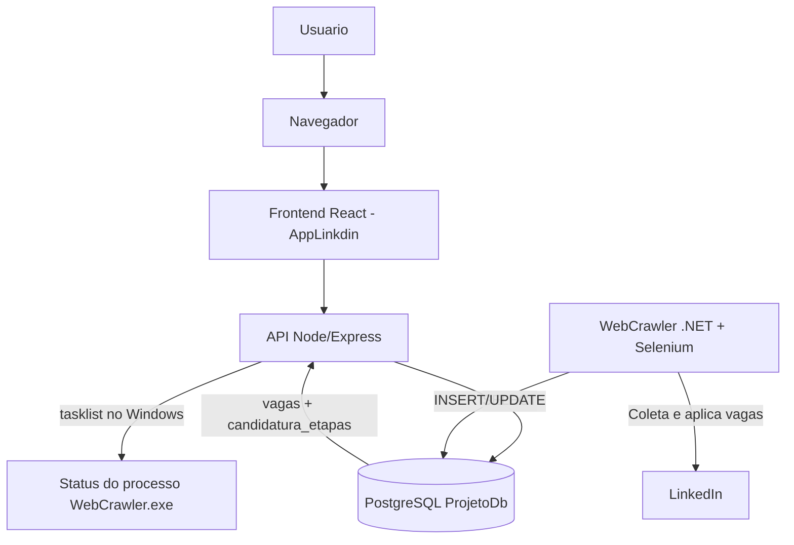

# Projeto Linkdim

Automacao de candidaturas no LinkedIn com observabilidade via dashboard.

O projeto e composto por dois blocos principais:
- WebCrawler (.NET 8 + Selenium): coleta vagas Easy Apply e executa fluxo de candidatura.
- AppLinkdin (React + Node/Express): exibe indicadores, tabelas e status operacional em tempo real.

---

## 1) Visao geral da arquitetura



### Componentes

- WebCrawler
  - Linguagem: C# (.NET 8)
  - Bibliotecas principais: Selenium, Npgsql
  - Responsabilidades:
    - Login no LinkedIn
    - Coleta de vagas Easy Apply
    - Tentativa de candidatura automatica
    - Persistencia em banco (tabela vagas)
    - Log de etapas (tabela candidatura_etapas)

- AppLinkdin
  - Frontend: React + Vite
  - Backend: Node/Express + pg
  - Responsabilidades:
    - Expor APIs de saude e dashboard
    - Exibir metricas (sucesso, pendente, indisponivel)
    - Exibir tabelas paginadas
    - Exibir status online/waiting/offline do crawler

- PostgreSQL
  - Banco principal de estado operacional
  - Tabelas principais:
    - vagas
    - candidatura_etapas

---

## 2) Requisitos

- Windows 10/11
- .NET SDK 8
- Node.js 20+ e npm
- Google Chrome instalado
- PostgreSQL (testado com v18)
- Docker Desktop (opcional, diferencial para subir dashboard)

---

## 3) Configuracao de ambiente

### 3.1 Arquivo .env do projeto raiz (WebCrawler)

Copie o exemplo e ajuste credenciais:

```powershell
Copy-Item .env.example .env
```

Variaveis essenciais:
- LINKEDIN_USERNAME
- LINKEDIN_PASSWORD
- WEBCRAWLER_DB_CONNECTION

Exemplo de connection string:

```text
Host=localhost;Port=5432;Database=ProjetoDb;Username=postgres;Password=sua_senha
```

### 3.2 Arquivo .env do dashboard (AppLinkdin)

```powershell
Copy-Item Applinkdin/.env.example Applinkdin/.env
```

Variaveis principais:
- WEBCRAWLER_DB_CONNECTION
- APPLINKDIN_API_PORT (default: 4000)

Observacao importante para Docker:
- Se o PostgreSQL roda no host Windows e o dashboard roda em container, troque Host=localhost por Host=host.docker.internal no Applinkdin/.env.

---

## 4) Execucao local (sem Docker)

### 4.1 Iniciar o WebCrawler

No diretorio raiz do repositorio:

```powershell
dotnet run --project WebCrawler/WebCrawler.csproj
```

### 4.2 Iniciar dashboard (API + Web em modo dev)

Em outro terminal:

```powershell
cd Applinkdin
npm install
npm run dev
```

Acessos:
- Frontend: http://localhost:5173
- Health API: http://localhost:4000/api/health
- Dashboard API: http://localhost:4000/api/dashboard

---

## 5) Execucao com Docker Compose (diferencial)

Este modo sobe o dashboard completo (API + frontend servido pelo Express) em container.

```powershell
cd Applinkdin
docker compose up -d --build
```

Acesso:
- Dashboard/API: http://localhost:4000
- Health: http://localhost:4000/api/health

Para derrubar:

```powershell
docker compose down
```

Observacao:
- O WebCrawler nao esta containerizado neste momento. Para fluxo completo, rode o crawler localmente em paralelo:

```powershell
dotnet run --project WebCrawler/WebCrawler.csproj
```

---

## 6) Relatorio SQL operacional

Arquivo pronto no repositorio:
- relatorio_candidaturas.sql

Exemplo de execucao no PowerShell:

```powershell
$psql = "C:\Program Files\PostgreSQL\18\bin\psql.exe"
$env:PGPASSWORD = "sua_senha"
& $psql -h localhost -U postgres -d ProjetoDb -f .\relatorio_candidaturas.sql
```

---

## 7) Troubleshooting rapido

- Erro de lock no build do WebCrawler.exe
  - Pare processo em execucao antes de build/run.

```powershell
Get-Process WebCrawler -ErrorAction SilentlyContinue | Stop-Process -Force
```

- API em container sem conectar no banco local
  - No Applinkdin/.env, use Host=host.docker.internal.

- Erro de autenticacao PostgreSQL
  - Confirme Password na WEBCRAWLER_DB_CONNECTION.

- Dashboard sem dados
  - Verifique /api/health e se o crawler esta gravando em vagas/candidatura_etapas.

---

## 8) Relatorio AI-First

### 8.1 Objetivo AI-First

Aplicar IA como copiloto de engenharia para acelerar o ciclo completo:
- diagnostico
- implementacao
- validacao
- observabilidade

### 8.2 Como a abordagem AI-First foi aplicada

- Backend e dados
  - Parser de connection string Npgsql -> pg no backend Node.
  - Endpoints de health e dashboard validados contra banco real.

- Operacao e monitoramento
  - Indicador de status do crawler (running/waiting/offline) no topo do dashboard.
  - Heuristica de atividade combinando processo do Windows e recencia de eventos no banco.

- UX e visual analytics
  - Card de taxa com pie chart para sucesso/indisponivel/pendente.
  - Paginacao elegante nas tabelas, agora com 20 itens por pagina.

- DevOps
  - Dockerfile multi-stage e docker-compose para deploy rapido do dashboard.
  - Fluxo de execucao padronizado para ambiente local e container.

### 8.3 Entregas concretas

- Dashboard funcional com API integrada ao PostgreSQL.
- Arquitetura com coleta automatizada e observabilidade.
- Relatorio SQL operacional pronto para uso.
- Paginacao aplicada em todas as tabelas operacionais.

### 8.4 Resultado pratico

- Menos friccao para iniciar o projeto (local ou Docker Compose).
- Melhor leitura operacional (status, distribuicao, tabelas paginadas).
- Melhor rastreabilidade do fluxo de candidatura via candidatura_etapas.

### 8.5 Proximos passos AI-First

- Containerizar tambem o WebCrawler para stack 100% via Compose.
- Criar pipeline CI (build + health check + smoke test de API).
- Adicionar testes automatizados para regressao de dashboard e API.
- Evoluir relatorio com metricas historicas por dia/semana.

---

## 9) Estrutura principal

```text
Projeto_Linkdim/
  WebCrawler/                  # Crawler .NET
  Applinkdin/                  # Dashboard React + API Node
    server/index.js
    Dockerfile
    docker-compose.yml
  relatorio_candidaturas.sql   # Consultas operacionais
```
